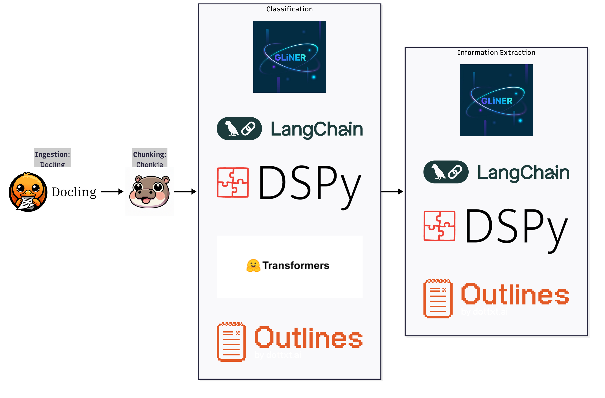

# `sieves`: A Unified Interface for Structured Document AI

Document AI is the process of turning unstructured documents - PDFs, emails, social media feeds - into structured data. Files are ingested, texts chunked, structured entities extracted, and perhaps a specialized model distilled for more efficient processing. Think invoices, support emails, or tweets at scale.

## Isn't this solved already?


_<sup>There's an xkcd for everything, including the current language model tooling landscape.</sup>_

The tools for these steps exist. They are excellent, and they are built with different paradigms and goals in mind. **[Outlines](https://github.com/dottxt-ai/outlines)** provides robust constrained generation. **[DSPy](https://github.com/stanfordnlp/dspy)** focuses on declarative prompt optimization. **[LangChain](https://github.com/langchain-ai/langchain)** has broad API support and a large ecosystem. **[GLiNER](https://github.com/fastino-ai/GLiNER2)** and **[Transformers](https://github.com/huggingface/transformers)** zero-shot classification pipelines offer specialized, high-performance inference.

Choosing one creates path dependency early in the application design. If you build your application logic around LangChain's abstractions, switching to a specialized model like GLiNER for efficiency is painful. You must migrate prompt signatures, integrations, and orchestration logic.

Too much developer time is lost to this friction, largely on integration and rework. You piece together disparate tools for ingestion, chunking, and prediction. You reinvent the same boilerplate for every project. This is a pattern we repeatedly encountered while working on document AI problems.

The missing piece was a stable, schema-first layer that sits above these tools and allows them to be composed without entangling application logic with a specific backend or execution framework.

To mitigate this, we built `sieves`. `sieves` is a framework-agnostic abstraction for building these workflows. It replaces imperative glue code with declarative design. Its modularity allows complex pipelines to be built from simple, reusable tasks.

`sieves` lets you mix and match language model frameworks within a single pipeline. That means you can assign the best
tool for each task instead of being locked into one framework.
For example, you might use a fast local `transformers` model for document classification, and a frontier LLM for challenging information extraction.
You might also want to experiment with different models and model types to see which work best for you.

With `sieves`, you can define and orchestrate this heterogeneous pipeline without rewriting your business logic.
You control how to execute your pipeline.



[![](https://mermaid.ink/img/pako:eNrtWmmP40Zz_isDBbsfzJ1p3se82DiSqIOSKFISLzETLJqHeN83Df_3UDP2vLF3X8dxgCAJtiVIfVR3PVVdTdVD6qeZnTnu7Hn2kt7irLN9WNYPh_NL-jAVIfXcqg6y9F9-eggS7_nhZebXdV49A1C6eVYFdVYOj0ECJ7EnL6j9xmoqt7SztHbT-snOEsDiNEazGI0Ch7BZyN64R3jjuEeS5G6PLEVbjyS0OJvlGNt28ZfZp4cYWm58V_XDD-_6f_jh-eUl5TM7DlLvLjQpv4vU93r3_ICh6KcH_5fvSX1VlzBI67tIlr7MHn5-s2fpN2k0rfC1ObCFNSz_kRENwFEKZ1gSo36sPuMs-rH9TP4O669rv0Fd-tnUcr8B9c8BjWFVBbfAhr_1vjOhfH71N8hT728WrFya_BRoC-ncofuNl82ncryo_kr1pppmTx9LZTkXX_tJmLH3CsAWorYyAAD3Jg_GiwLGwQDpaaov5Y6Vl2q8U674MSxppBVHsRcuK5920yIr9mFMuSqQR8RJTVwMhRH0ly3IFjeQeTzOtXCoSiEUBhnU5xEU5xT0g9AeBgDQ4Ig62_NJXfMgPwdEzdxA05P2dtH7V31dwKRcdPYWEPCWN4NpaJhNSnwIqkULOm2CK28BtlMAy42AZjN1vThj11EBA2kB1rHAkI6AZAxQBi1o1wpo1BTUPAFwWsKigRi7wVCLIYK7sN-ewsjc8cQyvVTpgUfnG54-OqEU-wMD-oQ9bEN0OPJNGQwsOCrYKPFsJIb9arfiiXMUHk-ospAiTbyENzTht0BVDeCEoylsFnenb_BVvDppZzKVcLjEXOuyCDaCOo_WaLjcnSZ3prvzid5jeoHXWGnmluESZdpygOFikyHNVTKMnD4UEFzYcYy0ywZuBlvuboqonk-r-V8vS9nfy_WaknemxJFIPXdcNRc5lEIJXeraAbnJxrlNvdFKfTqJ4DpPmtUqTWkacJOsP8keF74SVXYeWl0r4VumFpSrnO95-qx6Z7hGmmbqM0KK1t11gQ2VCrMtiwAOQYP4bMjX9ga1W91IbUdKcr_ZkylGhRu8PMO8NKAuaDpSjCSYt5ALN612DWKD2QRnhyqMZt60CiwYR3c5I2UTozqvYFin0nDWpZFjVuBYZ9JNKU2aHvQF5OsgkbEwP8yPuotdaiLGCYzCOPki1eveHg_xtWwNgkAUlLC2gXIto4Flih5J4qKoSwqFJLKPmZIvxWvK4NbN8GUvBKLpc3m3MV3b1TF2neGK1uR6iN8YYFfFgG0zPYEHvpm2dtUWlF8PSH4uiuLKa6qDByZnbNYYG-7xKdT3-Lgzl5YUIDxeGu5VO-gVUrWRSQkrVnSM2Jq0SidMkg8l43AUl6-W3sZ00t0hiCQj7wnL6GARF11L546q5YHJW9SIsF1q7bdK5rL6IYlbf6BFcCjUfqVfTh1-vpZXZuOXu6I6b9Fo37FZOG_HDSKsBCYC1HZD59q5yPJ1hNnpDhjSJbCWtNrvdxeyDle6f4gsythvb_y-Q3AYGwgUyLYVi1uBWavMKOcA6fTWtBjX1BzCv1p9PIJdwPolKy0sQQlcHm0JTcw4bGWqVERUJdzZUrZGFKFMOxBJpEUUGt_5sY2rmcn1-s0KE1TuT14cnWSFSFQr6CzDqlPiiHhLbY_WchVYcoaMsLhteTrBFgVQNzpyQq7Hs6-MTRIquq4qnsD4TUImpB1eUnyBVewp3TfSgbGMTVLrF6hgNHbEuSCPL4eRY62aqJyq1pdqzWTsam2sFES2WKtC9zYTO0CcE2RZD4Pisx3sT3g8lFTFRtbmFA98fZBwPd1vacxYYQK1JjGUsuQa9YurIIc0MD3UnZvlkS6zjVdETY-3LJDl8YjcNmOjySmLYDqD6rtoTPpKKNeOF5X9dAXLcDaTpwPHlSQhEI3lQkxh7Vq8nCnTsI7DgdvFdbMvjtezEaQYer3QKCzpoS6XJMkvWMxgWdaoyCRjE5Zwq5ifpwx5JbJ62Zm1a14gfsQz9ZRK7W6zFo2gppZSf9LdCItOYtd2pQjRw_Zwjsojq5n-2nHpPS9Lez6-rI8rKzSDI25YcyAjPCQEaPqYyB6FjMIPBYYgxhanpiusmFon1XfwihVCD9Ig4Hw5L5ZwdWs0rbqJ0Tk5im6OyVdcR6EQ-heV6IXtQSlotJEWC9fU7Q1iu6Hbu6gQINNmzY8NTVrGjaJvN8LiXA7E64PBW7WPyrq0bLTGbVQ_QphYyXWENogyNrAgMIHsMTwqVeN0oK5CLUwpC7afYjpONH2ut9ahqQUHzfHRzanqdpX21NUdyOv5smFNDhgadwM9alrNkjSgrDoWsTxvmh1Gb8jAxWMjqBLFaY9JPvdbm2op83rtOUAMraiZVlIwl2pd9vrYI-zCpXjClIgrlsmi4wpeuJZw0TmogWXMQ-vSdKO5yAOAEPhyp1Gw3pCloB7wtr3lQyrv1Y7UdiXoILtWJH8sWpdsjcYLY4HbooTUJLwI9aag5GFNMeem6wK48X243pw3tCdpie1HTEVPHqjEU7klRN6GHEgYl2Tsy-Cne2lv4ftoPVpDJTcHjcy7OZX77tVo5X0pJhR0NBVv0mkNB1ODKUbocyFdhqoVkAtzzvNcb3I6oIxqVXBImms5FGnOylJSitlC1XcFNS-H3HSvRYYejCQSuIQjNdVaEwdXKIG0NtLDzYuv0bgbxPFkXZe8fj2HUMMUgdhHqgSGk5iKgoglbHR09km4yXdCAqX4xBxQoO91tS7WULd3vLEfKynaZYfA27i6YW56CY2PsoeOEjKGpWZRVOXohynHmRMrnQiU44h0tMjhrYr2TdWLpXs5svtLNf0MQnYZR_ZyQSTRyPXOiTja2pHWC2-9URpSvB6doXVTqmWGEoCYBHVFbUFSL6pV6MNdDMewSkYtVtmtEKBHr9mv5nK3VaLDcXncXZjc2DFikc6x4gQrqyZ7taK0gJVWvKwzepXQcLGnGJ7lbVStAI_0Uck2g8YkBppHlUrvGIkYtD1-XZ1zM0kVeoE5JsUtm_R4OBJWgpA3BdoKYpb6cNlUIFhscaLZ-lxD9dNJrra2WJzm_-1CzhlqMfLUjbN2rq0vXztX8VqJLs0pWS5_n1n_Jhl-y6-VEqbVLSsTt6y-kWTj1J9Ks4X0vsTrsqt-ErG_zXXc1J6CsXadx9pK0Sevqqcp9iszeOM-Pxafp5Hn-dHhNvbFH3MCNeYXY5Q3pYqP2BCWAqWrZSA8CiN-xMLuY_UV03lH8uC-Q3mz9eEAU2_pTwb83tI_tvDNxqqxvBLm_jTwW0e-zN4E7sUJSvdV4zv1e2Mh1ZfNxLjc8muf3Eo4-f73ROnNHSCea6erR7WxNFjbUsN2N7rIU4ylYvVp4i0_doFT-58xjMA_-m7g-fVUx-hv8TrqD_fvV5DvDvoaZ9YPk5urpyADX9LJs28Qf2zK-POryAdi_gFfT-9fWGxeThfpaXODbOr7ZfJj51pTy_wyXY1TZ95XwaJz1cuXeFJr39XejfpArGFTZx8I_m0nP-DLySN56VbVx-4zxuHox-IzQ33DSAL9U0byF3n42j6nyocnGIC3mJys8167vsSZl91h_XV92_V33vmdd37nnd9553fe-Z13fued33nnd975nXf-f-edfy1Xlpr6zpOqr_PztwdKr-TIyeq6rx-nZD37RRyUsAPJtPA0ZldgYmduXb2TqCmDf3RgGT0mmeM-Va33T57_947HLI2H_wriX_G-IXdT5xsM8ZuE-GX2r_-Rnv594N_-MwIprP7388cJ4x_QxyaPM-g8dUEUJK4TwKes9MC9ld9bYMKcTKuDaY8TC9CARsH7Yl8Odwo2bRvAcBbN-8evR16NwVGcQmkMn14YRfy1GJyM-J-kh5O6_wsR_1Wkvz9Pfvj8-Z_fnwa_NX5zb-S169uHIZ19mnll4Mye67JxP82mKJ7smZqzn-5KJli-m7gvszuM1G2mefH9TsvP07QcpmaWJb_OLLPG82fPNxhXU6vJJ5Lt8gGczmLy3ltO6N1ymTVpPXsmcJR8XWX2_NOsnz1jDPWEEhSFMlMMYSRLTqPD7BknmSeC5CiGZSmGxDGW_fnTbHxVjD6xKEuzLEnQHMfhHMt9mk2BXGel-PYvgNc_A_z878LafVM?type=png)](https://mermaid.live/edit#pako:eNrtWmmP40Zz_isDBbsfzJ1p3se82DiSqIOSKFISLzETLJqHeN83Df_3UDP2vLF3X8dxgCAJtiVIfVR3PVVdTdVD6qeZnTnu7Hn2kt7irLN9WNYPh_NL-jAVIfXcqg6y9F9-eggS7_nhZebXdV49A1C6eVYFdVYOj0ECJ7EnL6j9xmoqt7SztHbT-snOEsDiNEazGI0Ch7BZyN64R3jjuEeS5G6PLEVbjyS0OJvlGNt28ZfZp4cYWm58V_XDD-_6f_jh-eUl5TM7DlLvLjQpv4vU93r3_ICh6KcH_5fvSX1VlzBI67tIlr7MHn5-s2fpN2k0rfC1ObCFNSz_kRENwFEKZ1gSo36sPuMs-rH9TP4O669rv0Fd-tnUcr8B9c8BjWFVBbfAhr_1vjOhfH71N8hT728WrFya_BRoC-ncofuNl82ncryo_kr1pppmTx9LZTkXX_tJmLH3CsAWorYyAAD3Jg_GiwLGwQDpaaov5Y6Vl2q8U674MSxppBVHsRcuK5920yIr9mFMuSqQR8RJTVwMhRH0ly3IFjeQeTzOtXCoSiEUBhnU5xEU5xT0g9AeBgDQ4Ig62_NJXfMgPwdEzdxA05P2dtH7V31dwKRcdPYWEPCWN4NpaJhNSnwIqkULOm2CK28BtlMAy42AZjN1vThj11EBA2kB1rHAkI6AZAxQBi1o1wpo1BTUPAFwWsKigRi7wVCLIYK7sN-ewsjc8cQyvVTpgUfnG54-OqEU-wMD-oQ9bEN0OPJNGQwsOCrYKPFsJIb9arfiiXMUHk-ospAiTbyENzTht0BVDeCEoylsFnenb_BVvDppZzKVcLjEXOuyCDaCOo_WaLjcnSZ3prvzid5jeoHXWGnmluESZdpygOFikyHNVTKMnD4UEFzYcYy0ywZuBlvuboqonk-r-V8vS9nfy_WaknemxJFIPXdcNRc5lEIJXeraAbnJxrlNvdFKfTqJ4DpPmtUqTWkacJOsP8keF74SVXYeWl0r4VumFpSrnO95-qx6Z7hGmmbqM0KK1t11gQ2VCrMtiwAOQYP4bMjX9ga1W91IbUdKcr_ZkylGhRu8PMO8NKAuaDpSjCSYt5ALN612DWKD2QRnhyqMZt60CiwYR3c5I2UTozqvYFin0nDWpZFjVuBYZ9JNKU2aHvQF5OsgkbEwP8yPuotdaiLGCYzCOPki1eveHg_xtWwNgkAUlLC2gXIto4Flih5J4qKoSwqFJLKPmZIvxWvK4NbN8GUvBKLpc3m3MV3b1TF2neGK1uR6iN8YYFfFgG0zPYEHvpm2dtUWlF8PSH4uiuLKa6qDByZnbNYYG-7xKdT3-Lgzl5YUIDxeGu5VO-gVUrWRSQkrVnSM2Jq0SidMkg8l43AUl6-W3sZ00t0hiCQj7wnL6GARF11L546q5YHJW9SIsF1q7bdK5rL6IYlbf6BFcCjUfqVfTh1-vpZXZuOXu6I6b9Fo37FZOG_HDSKsBCYC1HZD59q5yPJ1hNnpDhjSJbCWtNrvdxeyDle6f4gsythvb_y-Q3AYGwgUyLYVi1uBWavMKOcA6fTWtBjX1BzCv1p9PIJdwPolKy0sQQlcHm0JTcw4bGWqVERUJdzZUrZGFKFMOxBJpEUUGt_5sY2rmcn1-s0KE1TuT14cnWSFSFQr6CzDqlPiiHhLbY_WchVYcoaMsLhteTrBFgVQNzpyQq7Hs6-MTRIquq4qnsD4TUImpB1eUnyBVewp3TfSgbGMTVLrF6hgNHbEuSCPL4eRY62aqJyq1pdqzWTsam2sFES2WKtC9zYTO0CcE2RZD4Pisx3sT3g8lFTFRtbmFA98fZBwPd1vacxYYQK1JjGUsuQa9YurIIc0MD3UnZvlkS6zjVdETY-3LJDl8YjcNmOjySmLYDqD6rtoTPpKKNeOF5X9dAXLcDaTpwPHlSQhEI3lQkxh7Vq8nCnTsI7DgdvFdbMvjtezEaQYer3QKCzpoS6XJMkvWMxgWdaoyCRjE5Zwq5ifpwx5JbJ62Zm1a14gfsQz9ZRK7W6zFo2gppZSf9LdCItOYtd2pQjRw_Zwjsojq5n-2nHpPS9Lez6-rI8rKzSDI25YcyAjPCQEaPqYyB6FjMIPBYYgxhanpiusmFon1XfwihVCD9Ig4Hw5L5ZwdWs0rbqJ0Tk5im6OyVdcR6EQ-heV6IXtQSlotJEWC9fU7Q1iu6Hbu6gQINNmzY8NTVrGjaJvN8LiXA7E64PBW7WPyrq0bLTGbVQ_QphYyXWENogyNrAgMIHsMTwqVeN0oK5CLUwpC7afYjpONH2ut9ahqQUHzfHRzanqdpX21NUdyOv5smFNDhgadwM9alrNkjSgrDoWsTxvmh1Gb8jAxWMjqBLFaY9JPvdbm2op83rtOUAMraiZVlIwl2pd9vrYI-zCpXjClIgrlsmi4wpeuJZw0TmogWXMQ-vSdKO5yAOAEPhyp1Gw3pCloB7wtr3lQyrv1Y7UdiXoILtWJH8sWpdsjcYLY4HbooTUJLwI9aag5GFNMeem6wK48X243pw3tCdpie1HTEVPHqjEU7klRN6GHEgYl2Tsy-Cne2lv4ftoPVpDJTcHjcy7OZX77tVo5X0pJhR0NBVv0mkNB1ODKUbocyFdhqoVkAtzzvNcb3I6oIxqVXBImms5FGnOylJSitlC1XcFNS-H3HSvRYYejCQSuIQjNdVaEwdXKIG0NtLDzYuv0bgbxPFkXZe8fj2HUMMUgdhHqgSGk5iKgoglbHR09km4yXdCAqX4xBxQoO91tS7WULd3vLEfKynaZYfA27i6YW56CY2PsoeOEjKGpWZRVOXohynHmRMrnQiU44h0tMjhrYr2TdWLpXs5svtLNf0MQnYZR_ZyQSTRyPXOiTja2pHWC2-9URpSvB6doXVTqmWGEoCYBHVFbUFSL6pV6MNdDMewSkYtVtmtEKBHr9mv5nK3VaLDcXncXZjc2DFikc6x4gQrqyZ7taK0gJVWvKwzepXQcLGnGJ7lbVStAI_0Uck2g8YkBppHlUrvGIkYtD1-XZ1zM0kVeoE5JsUtm_R4OBJWgpA3BdoKYpb6cNlUIFhscaLZ-lxD9dNJrra2WJzm_-1CzhlqMfLUjbN2rq0vXztX8VqJLs0pWS5_n1n_Jhl-y6-VEqbVLSsTt6y-kWTj1J9Ks4X0vsTrsqt-ErG_zXXc1J6CsXadx9pK0Sevqqcp9iszeOM-Pxafp5Hn-dHhNvbFH3MCNeYXY5Q3pYqP2BCWAqWrZSA8CiN-xMLuY_UV03lH8uC-Q3mz9eEAU2_pTwb83tI_tvDNxqqxvBLm_jTwW0e-zN4E7sUJSvdV4zv1e2Mh1ZfNxLjc8muf3Eo4-f73ROnNHSCea6erR7WxNFjbUsN2N7rIU4ylYvVp4i0_doFT-58xjMA_-m7g-fVUx-hv8TrqD_fvV5DvDvoaZ9YPk5urpyADX9LJs28Qf2zK-POryAdi_gFfT-9fWGxeThfpaXODbOr7ZfJj51pTy_wyXY1TZ95XwaJz1cuXeFJr39XejfpArGFTZx8I_m0nP-DLySN56VbVx-4zxuHox-IzQ33DSAL9U0byF3n42j6nyocnGIC3mJys8167vsSZl91h_XV92_V33vmdd37nnd9553fe-Z13fued33nnd975nXf-f-edfy1Xlpr6zpOqr_PztwdKr-TIyeq6rx-nZD37RRyUsAPJtPA0ZldgYmduXb2TqCmDf3RgGT0mmeM-Va33T57_947HLI2H_wriX_G-IXdT5xsM8ZuE-GX2r_-Rnv594N_-MwIprP7388cJ4x_QxyaPM-g8dUEUJK4TwKes9MC9ld9bYMKcTKuDaY8TC9CARsH7Yl8Odwo2bRvAcBbN-8evR16NwVGcQmkMn14YRfy1GJyM-J-kh5O6_wsR_1Wkvz9Pfvj8-Z_fnwa_NX5zb-S169uHIZ19mnll4Mye67JxP82mKJ7smZqzn-5KJli-m7gvszuM1G2mefH9TsvP07QcpmaWJb_OLLPG82fPNxhXU6vJJ5Lt8gGczmLy3ltO6N1ymTVpPXsmcJR8XWX2_NOsnz1jDPWEEhSFMlMMYSRLTqPD7BknmSeC5CiGZSmGxDGW_fnTbHxVjD6xKEuzLEnQHMfhHMt9mk2BXGel-PYvgNc_A_z878LafVM)
<!--

flowchart LR
    Ingestion@{ img: "https://repository-images.githubusercontent.com/826168160/d3c8a8f9-af99-449f-856b-4ab9c897cce2", label: "**Ingestion**:\nDocling", pos: "t", w: 100, h: 100, constraint: "on" }
    Chunking@{ img: "https://avatars.githubusercontent.com/u/205278415?s=280&v=4", label: "**Chunking**:\nChonkie", pos: "t", w: 0, h: 100, constraint: "on" }
    Classification@{ img: "data:image/png;base64,iVBORw0KGgoAAAANSUhEUgAAAVcAAACTCAMAAAAN4ao8AAAA/1BMVEX///8AAAD/zST/zyX/nQD/zCPw8PCUlJTY2Njr6+vMzMxISEh6enqoqKjl5eU/Pz+dnZ2MjIz/xSH/oBf/ogD29vaysrIjIyP/tRz/qRn/xyIvLy//0iN0dHRQUFD/pRi3t7f/ux4cHBxhYWFqamrBwcH/3afpuyZXV1c4ODj/sBv/wV///PH/1JT/89z/68oUFBR1YzT/y4b/8db/ynz/47X/riv/vFT/uUn/tD3/26O1ky3zwyXUqykaJjxHQjkZJD3CnSsnLD0AGD6NdjOlhy7/xm8LHj0yNDuriy8/NT1zOD8kMjxEJED3RkjNQ0TBOkVMSjf0mDH/UUX/djzZIGBcAAAG2ElEQVR4nO2aC1ebSBiGIUAkF0jCJQISEnJRQ6K1Wq2t1rZpbXe3rnv9/79lZ74ZEmyz9Wyqa/S8zzkVSGaGycPwfTMURQEAAAAAAAAAAAAAAAAAAAAAAAAAAAAAAAAAAAAAAAAAAAAAAAAAAAAAAAAAAACPhKPtF5PJZO94+tAdeUpM90503WOwvy+fPXRvngzbnh6mkaFpmuEEnn66/9AdehpM9NBhTkscpjbwvO2H7tITYPpKD6RUgRaF+uuH7tXj56WeFq1ysUaoH8+/9+0ilRXPYvfaVftuOvw4OPxGK4n15jG2rRaprXaWIVW+qz4/Ava9jGvVYilX7GiRd5qXuAuvTaq7dWe9Xn8mXsREajtnOyRWOz97E/NtoOfTrZ66yWBaDtimP1jpLANWe1St3l231519PSOtFxczLlYrvX33+T03bHiTYrky87qx+mlqqtr50a4+Kl7rDrMYn72bfXhPgj/MZh9pwGZeceW18Fo2TVupWj2f7/csqy1HoWmaLDu1rZEvq5hty+pRqqqYDVUd2iZ9XGF18jK2afpK2zJZCbOi+D2rXeYVLWs+svkZ5IE8MdXlbbfXOQ1OPLr7d959pECgGZdnJLikOXpx3bXwaqlqwv6pdUVpiZDb5z+8wnbKHToe8WLmlvhy6M/LqUxEWSQw2RYrY7GhrJqsRH0kKw8ojAvzG+IEI7k/5HG6pVRqopFk1cnJ/XOSibC6UxKJS4tjEWhLkb5XKHfDKw+2alX+aI4vvMqfq1bEoXrA/+wWvZb7eZVd3hYbxlz/Ji8hr8OBbITieD0v3VMo91EZU5k3sraJcOoF+TIrnw/kO4b3qVDwhlc2UoZ9xWfbjm0PxQglkQPT3mUbiwbXbtn3N+gCVK0tPsibPo+zaqfHD6m1Bq/UGW+Q+YNRhTzumjTWWUTgI7hum4m4cjSn2B1s8QnKuOL7bXGmtWSaT161N29iplSLz98bt3sdstWCUt7o8EFXET+Pb8bs0Kc7ld/MA34rtyyTh8waxQ2lyr5s8kbGQlyDtLO2WnKH61XE1I5F4105bPt0hqYIPj6/Zg0eAZrN6roGgqkux2v8/PPzN+fGzuVPn8+1W70WJkzmxsIrFdgkrxQjko28oPRaF9r43I3ubea1T8ctMSR5ZXbNyL9JltuKqNYRXin10YS60ar6ytrC44DB81X888Xs4mo8m83eslDAn74Y3otCwZteZSa2N2oUQnOvJGFMXit5COxQWek1kQMwvwrMa0LHLRkrN8VZhFde6KDPOKDlSFNEbjZiN2XbA/P+Da3IaZh1M8NIo52Lq1++XH25uriMnbQUhd2s8Ijga6/i9hPpqCaEfuVVsfMkRmNMep1PY2W0aIjhSU3xIHLTq60uOBBeZWcG+cejexe0Ii+8btANu64bXf56ff3b9e9/lFLXDbth0PWOCuVueuUhk+7lTpW+6X3rlX1iiZ/Pg7D0OszXwaYItI3c81KvvMlmVWAWvbLutId0p2zep5sfYOK5Yey4YRSG8Z9/XV9f/x0ZbuC4XaPUdb3CRGuJ16G4ie2lXismTdvNmpAhvc5v5ZYYx9/3yvMVZbmq7SsFrxWzx+8Be5D3ZO3Y1oPMdeIgjFO2MdLUibXAjbSuwzZBpi/+32CJV5atG4rIUL2vvfpynPKUw4VJr/wa8FTOhzqve4vXugjlI9H03OumDMaWuq5PyF57RuwwiaGhhaFGRG6gOVmchk7s6ItIsMQrH3MDca9/m7e47cSyhnKOKb2KkFzbysPuLV4pwA5pheYXvPKrMm5adVU2un7s6d1Ui0LH6RqOSysvI+S7RpppWup6i5XsEq9+npVpaM69bon4Ol8qUWJq5ArypZeYqo0LXmkI9m94VUbF3LeIr/OFXnLfglYkzJyMzQbYCDWYRjaV1TI3KkUO/yQMnMIM1m8kNdKmjGpJImaOlQ7L0/WKWUtqFaWcJDXKzsOkJoLigGeWXZGxO0lNPg0zO+zjrVb55sdWLSH/A3EW3iTNz+w6M92vU0xusxMreSN8KSs7tIa8ClkcCB3mkz9xdQ3NcVN6WqgFGTu4MYNdyven5v7yr//l4/ts5H/mtBsEjhaJlazjsmzVlU8HIi0NguKEAPwHTkLNCNJS7pXJ7MqnA1qQasbt4xUs5Vi8OEDPW7Wsm6aBK57D8Dc0Us/D+xkr8uyV7mX0pksU6J7O3yVK2YERpZmnT6B1dZ59CunNLN3bm+4fTacT+ZrWySGs/iBH23uHh9u5xiN2sHcMqQAAAAAAAAAAAAAAAAAAAAAAAAAAAAAAAAAAAAAAAAAAAAAAAAAAAAAAAAAAAAAAAAAA4A75BzD5f9bJecWCAAAAAElFTkSuQmCC", label: "**Classification**:\nTransformers", pos: "t", w: 250, h: 100, constraint: "on" }
    InformationExtraction@{ img: "https://encrypted-tbn0.gstatic.com/images?q=tbn:ANd9GcShzp30XASXzPGrU2z1yjrI5WUriI-Iz2N1jw&s", label: "**Information extraction**:\n LangChain", pos: "t", h: 100, constraint: "on" }

    subgraph "Classification"
        direction LR
        Cls_Gliner@{ img: "https://framerusercontent.com/images/lAVQYg5vlOybHrV1Jf6qpn185lU.png?width=1132&height=1116", pos: "t", w: 150, constraint: "on" }
        Cls_LangChain@{ img: "https://oxylabs.io/_next/image?url=https%3A%2F%2Fimages.prismic.io%2Foxylabs-web%2FZ_Y1ondAxsiBweUS_langchain.png%3Fauto%3Dformat%2Ccompress&w=1920&q=75", pos: "t", w: 300, constraint: "on" }
        Cls_DSPy@{ img: "https://dspy.ai/static/img/dspy_logo.png", pos: "t", w: 300, constraint: "on" }
        Cls_HF@{ img: "data:image/png;base64,iVBORw0KGgoAAAANSUhEUgAAAVcAAACTCAMAAAAN4ao8AAAA/1BMVEX///8AAAD/zST/zyX/nQD/zCPw8PCUlJTY2Njr6+vMzMxISEh6enqoqKjl5eU/Pz+dnZ2MjIz/xSH/oBf/ogD29vaysrIjIyP/tRz/qRn/xyIvLy//0iN0dHRQUFD/pRi3t7f/ux4cHBxhYWFqamrBwcH/3afpuyZXV1c4ODj/sBv/wV///PH/1JT/89z/68oUFBR1YzT/y4b/8db/ynz/47X/riv/vFT/uUn/tD3/26O1ky3zwyXUqykaJjxHQjkZJD3CnSsnLD0AGD6NdjOlhy7/xm8LHj0yNDuriy8/NT1zOD8kMjxEJED3RkjNQ0TBOkVMSjf0mDH/UUX/djzZIGBcAAAG2ElEQVR4nO2aC1ebSBiGIUAkF0jCJQISEnJRQ6K1Wq2t1rZpbXe3rnv9/79lZ74ZEmyz9Wyqa/S8zzkVSGaGycPwfTMURQEAAAAAAAAAAAAAAAAAAAAAAAAAAAAAAAAAAAAAAAAAAAAAAAAAAAAAAAAAAACPhKPtF5PJZO94+tAdeUpM90503WOwvy+fPXRvngzbnh6mkaFpmuEEnn66/9AdehpM9NBhTkscpjbwvO2H7tITYPpKD6RUgRaF+uuH7tXj56WeFq1ysUaoH8+/9+0ilRXPYvfaVftuOvw4OPxGK4n15jG2rRaprXaWIVW+qz4/Ava9jGvVYilX7GiRd5qXuAuvTaq7dWe9Xn8mXsREajtnOyRWOz97E/NtoOfTrZ66yWBaDtimP1jpLANWe1St3l231519PSOtFxczLlYrvX33+T03bHiTYrky87qx+mlqqtr50a4+Kl7rDrMYn72bfXhPgj/MZh9pwGZeceW18Fo2TVupWj2f7/csqy1HoWmaLDu1rZEvq5hty+pRqqqYDVUd2iZ9XGF18jK2afpK2zJZCbOi+D2rXeYVLWs+svkZ5IE8MdXlbbfXOQ1OPLr7d959pECgGZdnJLikOXpx3bXwaqlqwv6pdUVpiZDb5z+8wnbKHToe8WLmlvhy6M/LqUxEWSQw2RYrY7GhrJqsRH0kKw8ojAvzG+IEI7k/5HG6pVRqopFk1cnJ/XOSibC6UxKJS4tjEWhLkb5XKHfDKw+2alX+aI4vvMqfq1bEoXrA/+wWvZb7eZVd3hYbxlz/Ji8hr8OBbITieD0v3VMo91EZU5k3sraJcOoF+TIrnw/kO4b3qVDwhlc2UoZ9xWfbjm0PxQglkQPT3mUbiwbXbtn3N+gCVK0tPsibPo+zaqfHD6m1Bq/UGW+Q+YNRhTzumjTWWUTgI7hum4m4cjSn2B1s8QnKuOL7bXGmtWSaT161N29iplSLz98bt3sdstWCUt7o8EFXET+Pb8bs0Kc7ld/MA34rtyyTh8waxQ2lyr5s8kbGQlyDtLO2WnKH61XE1I5F4105bPt0hqYIPj6/Zg0eAZrN6roGgqkux2v8/PPzN+fGzuVPn8+1W70WJkzmxsIrFdgkrxQjko28oPRaF9r43I3ubea1T8ctMSR5ZXbNyL9JltuKqNYRXin10YS60ar6ytrC44DB81X888Xs4mo8m83eslDAn74Y3otCwZteZSa2N2oUQnOvJGFMXit5COxQWek1kQMwvwrMa0LHLRkrN8VZhFde6KDPOKDlSFNEbjZiN2XbA/P+Da3IaZh1M8NIo52Lq1++XH25uriMnbQUhd2s8Ijga6/i9hPpqCaEfuVVsfMkRmNMep1PY2W0aIjhSU3xIHLTq60uOBBeZWcG+cejexe0Ii+8btANu64bXf56ff3b9e9/lFLXDbth0PWOCuVueuUhk+7lTpW+6X3rlX1iiZ/Pg7D0OszXwaYItI3c81KvvMlmVWAWvbLutId0p2zep5sfYOK5Yey4YRSG8Z9/XV9f/x0ZbuC4XaPUdb3CRGuJ16G4ie2lXismTdvNmpAhvc5v5ZYYx9/3yvMVZbmq7SsFrxWzx+8Be5D3ZO3Y1oPMdeIgjFO2MdLUibXAjbSuwzZBpi/+32CJV5atG4rIUL2vvfpynPKUw4VJr/wa8FTOhzqve4vXugjlI9H03OumDMaWuq5PyF57RuwwiaGhhaFGRG6gOVmchk7s6ItIsMQrH3MDca9/m7e47cSyhnKOKb2KkFzbysPuLV4pwA5pheYXvPKrMm5adVU2un7s6d1Ui0LH6RqOSysvI+S7RpppWup6i5XsEq9+npVpaM69bon4Ol8qUWJq5ArypZeYqo0LXmkI9m94VUbF3LeIr/OFXnLfglYkzJyMzQbYCDWYRjaV1TI3KkUO/yQMnMIM1m8kNdKmjGpJImaOlQ7L0/WKWUtqFaWcJDXKzsOkJoLigGeWXZGxO0lNPg0zO+zjrVb55sdWLSH/A3EW3iTNz+w6M92vU0xusxMreSN8KSs7tIa8ClkcCB3mkz9xdQ3NcVN6WqgFGTu4MYNdyven5v7yr//l4/ts5H/mtBsEjhaJlazjsmzVlU8HIi0NguKEAPwHTkLNCNJS7pXJ7MqnA1qQasbt4xUs5Vi8OEDPW7Wsm6aBK57D8Dc0Us/D+xkr8uyV7mX0pksU6J7O3yVK2YERpZmnT6B1dZ59CunNLN3bm+4fTacT+ZrWySGs/iBH23uHh9u5xiN2sHcMqQAAAAAAAAAAAAAAAAAAAAAAAAAAAAAAAAAAAAAAAAAAAAAAAAAAAAAAAAAAAAAAAAAA4A75BzD5f9bJecWCAAAAAElFTkSuQmCC", pos: "t", w: 300, constraint: "on" }
        Cls_Outlines@{ img: "https://github.com/dottxt-ai/outlines/raw/main/docs/assets/images/logo-dark-mode.svg#gh-dark-mode-only", pos: "t", w: 300, constraint: "on" }
    end

    subgraph "InformationExtraction"[Information Extraction]
        direction LR
        IE_Gliner@{ img: "https://framerusercontent.com/images/lAVQYg5vlOybHrV1Jf6qpn185lU.png?width=1132&height=1116", pos: "t", w: 150, constraint: "on" }
        IE_LangChain@{ img: "https://upload.wikimedia.org/wikipedia/commons/thumb/6/60/LangChain_Logo.svg/1280px-LangChain_Logo.svg.png?20250612121153", pos: "t", w: 300, constraint: "on" }
        IE_DSPy@{ img: "https://dspy.ai/static/img/dspy_logo.png", pos: "t", w: 300, constraint: "on" }
        IE_Outlines@{ img: "https://github.com/dottxt-ai/outlines/raw/main/docs/assets/images/logo-dark-mode.svg#gh-dark-mode-only", pos: "t", w: 300, constraint: "on" }
    end

    Ingestion ==> Chunking ==> Classification ==> InformationExtraction

-->


## Declarative Document AI

`sieves` decouples the business logic - the "what" - from the execution framework - the "how."

You focus on the data you need and the **structure it should conform to**, while the framework handles execution. Because `sieves` provides a unified interface over multiple backends for structured generation, you can swap execution engines by changing a single parameter. The rest of your pipeline remains untouched.

`sieves` acts as a cohesive layer for the entire document AI lifecycle:

1.  **Ingestion**: Standardized parsing of PDFs, images, and Office docs via **[docling](https://github.com/DS4SD/docling)**.
2.  **Preprocessing**: Built-in text chunking and windowing via **[chonkie](https://github.com/chonkie-inc/chonkie)**.
3.  **Task Library**: A collection of ready-to-use tasks like NER, classification, and summarization. Skip the prompt engineering and focus on the schema.
4.  **Prediction**: Structured generation across `outlines`, `dspy`, `langchain`, `gliner2`, and `transformers` zero-shot classification pipelines.
5.  **Persistence**: Save and load pipelines with their configurations to ensure reproducibility across environments.

## Evaluation, Optimization, Distillation

A production pipeline is not static. You need to know if it works and how to make it better. `sieves` builds these needs into the core workflow.

**Evaluation** is a first-class citizen. You can measure pipeline performance against ground-truth data using deterministic metrics or LLM-based judging. This allows you to track regression as you update models or prompts.

If your documents contain ground truth/gold data, you can evaluate your pipeline like so:
```python
results = list(pipeline(docs))
eval_report = pipeline.evaluate(results)
# Inspect the evaluation results for pipeline components:
for task_id in eval_report.reports:
    print(eval_report[task_id].summary())
# In the case of our case study (see below) this prints something like
# 'Task: crisis_label_classifier | Metrics: F1 (Macro): 0.4874 | Failures: 48'
# 'Task: crisis_type_classifier | Metrics: F1 (Macro): 0.9563 | Failures: 16'
# 'Task: location_extractor | Metrics: Accuracy: 0.1900 | Failures: 89'
```

**Optimization** is integrated via DSPy's MIPROv2. If your extraction precision is low, `sieves` can automatically optimize your prompts and few-shot examples.

In order to optimize your tasks to have to
- provide your task with fewshot examples
- initialize an optimizer
- run `task.optimize()`

Use it like this:
```python
task = Classification(..., fewshot_examples=...)
optimizer = Optimizer(...)
best_prompt, best_examples = task.optimize(optimizer)
```

**Distillation** completes the cycle. Once you have a high-performing pipeline using a large LLM, you can distill that logic into a specialized local model using **SetFit** or **Model2Vec**. This reduces costs and latency without a total rewrite of your application.

In order to e.g. distill a classification task with `setfit`, you call the tasks `.distill()` method:
```python
task = Classification(...)
# This distills a `setfit` model from the results in `docs` and stores it at `output_path`.
task.distill(..., data=docs, framework=DistillationFramework.setfit, output_path=...)
```

## Small Abstractions

We built `sieves` around three objects:

- **Doc**: The atomic unit of data. It holds text, metadata, and the pipeline's history.
- **Task**: A reusable unit of work. It encapsulates logic and schema validation.
- **Pipeline**: A sequence of tasks. It manages execution, caching, and conditional logic.

Tasks are portable. A sentiment analysis task defined for a prototype with GPT-4 will work with a local Llama model. The schema is the contract.

## Case Study: Filtering the Noise

In our **[Crisis Tweet Case Study](https://sieves.ai/demos/crisis_tweets)**, we used the CrisisNLP dataset to solve a common engineering problem: noise. Social media text is informal and often irrelevant to emergency response.

Running complex extraction on every noisy tweet wastes money, time, and introduces avoidable errors.
To address this, we built a multi-stage pipeline. A classifier identifies if a tweet is crisis-related. A "gatekeeper" condition determines if the expensive extraction tasks should run.

This kind of conditional execution is straightforward only when classification, extraction, and orchestration are expressed as first-class pipeline components. Without explicit task boundaries and structured results, this logic quickly devolves into ad-hoc control flow and duplicated checks scattered across the codebase.

```python
def related_to_crisis(doc: Doc) -> bool:
    result = doc.results.get("crisis_label_classifier")
    return result and result.label != 'irrelevant'

pipeline = (
    crisis_label_classifier +
    tasks.InformationExtraction(
        task_id="location_extractor",
        entity_type=Country,
        model=model,
        condition=related_to_crisis
    )
)
```

Filtering the noise before the later extraction stage can significantly improve the reliability of your pipeline. Don't ask your model to extract entities from irrelevant text, and you'll end up with a more resilient, accurate, and cheaper system.

## What v1.0 Means

We are releasing v1.0 to signal API stability. We have used `sieves` in production for complex, multi-stage document processing. The abstractions are robust enough to handle the rapid evolution of the underlying LLM ecosystem.

We are committed to stability. The underlying models and frameworks will change. Your `sieves` pipelines should remain a stable part of your infrastructure.

We also presented an earlier version of `sieves` at PyData Amsterdam 2025, where we walked through the design rationale, core abstractions, and examples. The recording is available [here](https://www.youtube.com/watch?v=5i8tEvrYEyQ).

## When to Use sieves

`sieves` is for teams building document-centric NLP pipelines.

- **Good fits**: Structured data extraction, multi-stage processing, and moving from prototypes to production without backend lock-in.
- **Poor fits**: Chatbots, RAGs or simple one-off LLM calls where a single prompt suffices.

***

*`sieves` is open-source under a MIT license and available on **[GitHub](https://github.com/MantisAI/sieves)**. Read the documentation and see the full case study at **[sieves.ai](https://sieves.ai)**.*
